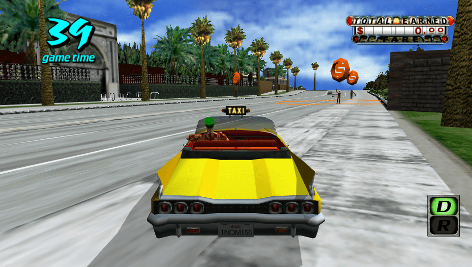

# Crazy Taxi Classic Vita

<p align="center"></p>

This is a wrapper/port of *Crazy Taxi Classic Android* for the *PS Vita*.

The port works by loading the official Android ARMv7 executable in memory, resolving its imports with native functions and patching it in order to properly run.
By doing so, it's basically as if we emulate a minimalist Android environment in which we run natively the executable as is.

## Setup Instructions (For End Users)

In order to properly install the game, you'll have to follow these steps precisely:

- Install [kubridge](https://github.com/TheOfficialFloW/kubridge/releases/) and [FdFix](https://github.com/TheOfficialFloW/FdFix/releases/) by copying `kubridge.skprx` and `fd_fix.skprx` to your taiHEN plugins folder (usually `ux0:tai`) and adding two entries to your `config.txt` under `*KERNEL`:
  
```
  *KERNEL
  ux0:tai/kubridge.skprx
  ux0:tai/fd_fix.skprx
```

**Note** Don't install fd_fix.skprx if you're using repatch plugin

- **Optional**: Install [PSVshell](https://github.com/Electry/PSVshell/releases) to overclock your device to 500Mhz.
- Install `libshacccg.suprx`, if you don't have it already, by following [this guide](https://samilops2.gitbook.io/vita-troubleshooting-guide/shader-compiler/extract-libshacccg.suprx).
- Obtain your copy of *Crazy Taxi Classic* legally from the Google Play store in form of an `.apk` file and one or more `.obb` files (usually located inside the `/sdcard/android/obb/com.sega.CrazyTaxi/`) folder. [You can get all the required files directly from your phone](https://stackoverflow.com/questions/11012976/how-do-i-get-the-apk-of-an-installed-app-without-root-access) or by using an apk extractor you can find in the play store. The apk can be extracted with whatever Zip extractor you prefer (eg: WinZip, WinRar, etc...) since apk is basically a zip file. You can rename `.apk` to `.zip` to open them with your default zip extractor.
- Copy the `.obb` file to `ux0:data/crazytaxi` and rename it to `main.obb`
- Open the apk and extract `libgl2jni.so` from the `lib/armeabi-v7a` folder to `ux0:data/crazytaxi`.
- Install [CRAZYTAXI.vpk](https://github.com/TheOfficialFloW/crazytaxi_vita/releases/latest) on your *PS Vita*.

## Build Instructions (For Developers)

In order to build the loader, you'll need a [vitasdk](https://github.com/vitasdk) build fully compiled with softfp usage.  
You can find a precompiled version [here](https://github.com/vitasdk/buildscripts/releases) with the softfp tag for each operating system.
Additionally, you'll need these libraries to be compiled as well with `-mfloat-abi=softfp` added to their CFLAGS:

- [libmathneon](https://github.com/Rinnegatamante/math-neon)

  - ```bash
    make install
    ```

- [vitaShaRK](https://github.com/Rinnegatamante/vitaShaRK)

  - ```bash
    make install
    ```

- [kubridge](https://github.com/TheOfficialFloW/kubridge)

  - ```bash
    mkdir build && cd build
    cmake .. && make install
    ```

- [vitaGL](https://github.com/Rinnegatamante/vitaGL)

  - ````bash
    make SOFTFP_ABI=1 NO_DEBUG=1 SAMPLER_UNIFORMS=1 install
    ````

- [opensles](https://github.com/Rinnegatamante/opensles/tree/openal)

  - ````bash
    cd libopensles
    make CRAZY_TAXI=1 install
    ````
Finally, you'll need thi library recompiled with `-mfloat-abi=softfp` from [vitasdk/packages](https://github.com/vitasdk/packages):
- sndfile

After all these requirements are met, you can compile the loader with the following commands:

```bash
mkdir build && cd build
cmake .. && make
```

You can also use [vitasdk/vitasdk-softfp](https://hub.docker.com/r/vitasdk/vitasdk-softfp) with Docker.

## Credits

- Rinnegatamante for vitaGL and fixes.
- Silent for helping with contents restorations.
- Once13One for providing LiveArea assets.
